# Satisfyer

This repository serves the purpose of documenting information about Satisfyer toys.

## Usage relevant informations

### Vibration

The vibration can be controlled using the `liveControl` service. The actual vibration strength is set via `motorValue`. 4 bytes per motor. Each byte may range from `0x00` to `0x64` (% strength). The last byte will persist however depending on the device it may stop after a while, so resend it in an interval. Don't forget to set `motorMode` (see [Commands](#commands)).

### Device recognition

There are many ways to recognise Satisfyer devices. Using `dinfo` (see [BleDeviceService](#bledeviceservice)) to filter based on advertised services suffices in most caes but one could also check the advertised manufacturer data and/or the advertised local name.

### Manufacturer data

The device advertised manufacturer data contains exactly one key `0x5D` with the productID (see [Products](#products)) as the value.

## UUIDs

### BleDeviceService
| BleDeviceService | UUID |
|---|---|
| deviceControl | 51361600-c5e7-47c7-8a6e-47ebc99d80e8 |
| deviceInfo | 51361700-c5e7-47c7-8a6e-47ebc99d80e8 |
| dinfo | 0000180a-0000-1000-8000-00805f9b34fb |
| liveControl | 51361500-c5e7-47c7-8a6e-47ebc99d80e8 |

### Characteristics

#### BaseBleCharacteristic
| BaseBleCharacteristic | UUID |
|---|---|
| battery | 00002A19-0000-1000-8000-00805f9b34fb |
| controlMode | 51361601-c5e7-47c7-8a6e-47ebc99d80e8 |
| controlValue | 51361602-c5e7-47c7-8a6e-47ebc99d80e8 |
| deviceName | 00002A00-0000-1000-8000-00805f9b34fb |
| hardwareInfo | 51361701-c5e7-47c7-8a6e-47ebc99d80e8 |
| motorMode | 51361501-c5e7-47c7-8a6e-47ebc99d80e8 |
| motorValue | 51361502-c5e7-47c7-8a6e-47ebc99d80e8 |
| renameValue | 51361603-c5e7-47c7-8a6e-47ebc99d80e8 |

#### BleCharacteristicV3

| BleCharacteristicV3 | UUID |
|---|---|
| alarm | 51361603-c5e7-47c7-8a6e-47ebc99d80e8 |
| apiVersion | 00002A28-0000-1000-8000-00805f9b34fb |
| firmwareRevision | 00002A26-0000-1000-8000-00805f9b34fb |
| hardwareRevision | 00002A27-0000-1000-8000-00805f9b34fb |
| heating | 51361604-c5e7-47c7-8a6e-47ebc99d80e8 |
| keepAliveControl | 51361605-c5e7-47c7-8a6e-47ebc99d80e8 |
| productId | 00002A24-0000-1000-8000-00805f9b34fb |
| pumpControl | 51361606-C5E7-47C7-8A6E-47EBC99D80E8 |
| renameValue | 51361602-c5e7-47c7-8a6e-47ebc99d80e8 |
| serialNumber | 00002A25-0000-1000-8000-00805f9b34fb |

#### BleCharacteristicV4

| BleCharacteristicV4 | UUID |
|---|---|
| lockControl | 51361607-c5e7-47c7-8a6e-47ebc99d80e8 |

## Commands

| Command | Byte |
|---|---|
| disableHeat (V3) | 0 |
| enableHeat (V3) | 1 |
| play | 1 |
| pause | 3 |
| stop | 7 |
| unpair | 66 |
| heating | 67 |
| createAlarm | 80 |
| deleteAlarm | 81 |
| heartbeat | 87 |
| reboot | 94 |
| rename | 160 |

## Products

| icon | productName | productId | productFamily | hasHeater | hasPump | autoDeviceLock | channelMappings |
|---|---|---|---|---|---|---|---|
| 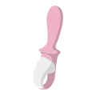 | Air Pump Booty 5+ | 10195 | PU | False | True | False | 0. Vibration (VIBRATION) |
| 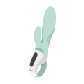 | Air Pump Bunny 5+ | 10188 | PU | False | True | False | 0. Shaft (VIBRATION) 1. Rabbit (VIBRATION) |
|  | Air Pump Vibrator 5+ | 10189 | PU | False | True | False | 0. Vibration (VIBRATION) |
| 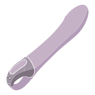 | Big Heat | 10007 | HV | True | False | False | 0. Vibration (VIBRATION) |
| | Bodywand (Virtual) | 5 | HV | False | False | False | 0. Vibration (VIBRATION) |
| 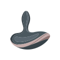 | Booty Absolute Beginners 5 | 10206 | SE | False | False | True | 0. Vibration (VIBRATION) |
|  | Booty Absolute Beginners 5 | 10207 | SE | False | False | True | 0. Vibration (VIBRATION) |
|  | Booty Absolute Beginners 5 | 10208 | SE | False | False | True | 0. Vibration (VIBRATION) |
|  | Bullseye | 10175 | RG | False | False | True | 0. Vibration (VIBRATION) |
|  | Bullseye | 10176 | RG | False | False | True | 0. Vibration (VIBRATION) |
|  | Curvy 1+ | 10027 | SP | False | False | False | 0. Vibration (VIBRATION) 1. Air Pulse (AIRPULSE) |
|  | Curvy 1+ | 10028 | SP | False | False | False | 0. Vibration (VIBRATION) 1. Air Pulse (AIRPULSE) |
|  | Curvy 2+ | 10030 | SP | False | False | False | 0. Vibration (VIBRATION) 1. Air Pulse (AIRPULSE) |
| 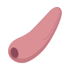 | Curvy 2+ | 10031 | SP | False | False | False | 0. Vibration (VIBRATION) 1. Air Pulse (AIRPULSE) |
|  | Curvy 3+ | 10055 | SP | False | False | False | 0. Vibration (VIBRATION) 1. Air Pulse (AIRPULSE) |
|  | Curvy Trinity 5+ | 10180 | CT | False | False | False | 0. Vibration (VIBRATION) 1. Air Pulse (AIRPULSE) |
|  | Curvy Trinity 5+ | 10181 | CT | False | False | False | 0. Vibration (VIBRATION) 1. Air Pulse (AIRPULSE) |
|  | Deep Diver | 10146 | AV | False | False | False | 0. Vibration (VIBRATION) |
|  | Deep Diver | 10147 | AV | False | False | False | 0. Vibration (VIBRATION) |
|  | Double Desire | 10160 | PA | False | False | True | 0. Clitoral (VIBRATION) 1. G-Spot (VIBRATION) |
|  | Double Desire | 10161 | PA | False | False | True | 0. Clitoral (VIBRATION) 1. G-Spot (VIBRATION) |
| 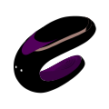 | Double Desire | 10162 | PA | False | False | True | 0. Clitoral (VIBRATION) 1. G-Spot (VIBRATION) |
|  | Double Flex | 10065 | DF | False | False | False | 0. Vibration (VIBRATION) 1. Rabbit 1 (VIBRATION) 2. Rabbit 2 (VIBRATION) |
|  | Double Flex | 10066 | DF | False | False | False | 0. Vibration (VIBRATION) 1. Rabbit 1 (VIBRATION) 2. Rabbit 2 (VIBRATION) |
| 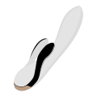 | Double Flex | 10067 | DF | False | False | False | 0. Vibration (VIBRATION) 1. Rabbit 1 (VIBRATION) 2. Rabbit 2 (VIBRATION) |
| 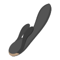 | Double Flex | 10068 | DF | False | False | False | 0. Vibration (VIBRATION) 1. Rabbit 1 (VIBRATION) 2. Rabbit 2 (VIBRATION) |
|  | Double Fun | 10049 | PA | False | False | True | 0. Clitoral (VIBRATION) 1. G-Spot (VIBRATION) |
|  | Double Fun | 10050 | PA | False | False | True | 0. Clitoral (VIBRATION) 1. G-Spot (VIBRATION) |
|  | Double Fun | 10051 | PA | False | False | True | 0. Clitoral (VIBRATION) 1. G-Spot (VIBRATION) |
|  | Double Joy | 10046 | PA | False | False | True | 0. Clitoral (VIBRATION) 1. G-Spot (VIBRATION) |
|  | Double Joy | 10047 | PA | False | False | True | 0. Clitoral (VIBRATION) 1. G-Spot (VIBRATION) |
|  | Double Joy | 10048 | PA | False | False | True | 0. Clitoral (VIBRATION) 1. G-Spot (VIBRATION) |
|  | Double Love | 10052 | PA | False | False | True | 0. Clitoral (VIBRATION) 1. G-Spot (VIBRATION) |
|  | Double Love | 10053 | PA | False | False | True | 0. Clitoral (VIBRATION) 1. G-Spot (VIBRATION) |
|  | Double Love | 10054 | PA | False | False | True | 0. Clitoral (VIBRATION) 1. G-Spot (VIBRATION) |
| 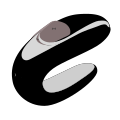 | Double Lust | 10163 | PA | False | False | True | 0. Clitoral (VIBRATION) 1. G-Spot (VIBRATION) |
|  | Double Lust | 10164 | PA | False | False | True | 0. Clitoral (VIBRATION) 1. G-Spot (VIBRATION) |
|  | Double Lust | 10165 | PA | False | False | True | 0. Clitoral (VIBRATION) 1. G-Spot (VIBRATION) |
| 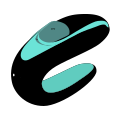 | Double Lust | 10166 | PA | False | False | True | 0. Clitoral (VIBRATION) 1. G-Spot (VIBRATION) |
|  | Double Wand-er | 10032 | BW | False | False | False | 0. Vibration (VIBRATION) |
|  | Dual Love | 10079 | SP | False | False | False | 0. Vibration (VIBRATION) 1. Air Pulse (AIRPULSE) |
|  | Dual Love | 10080 | SP | False | False | False | 0. Vibration (VIBRATION) 1. Air Pulse (AIRPULSE) |
|  | Dual Pleasure | 10081 | SP | False | False | False | 0. Vibration (VIBRATION) 1. Air Pulse (AIRPULSE) |
|  | Dual Pleasure | 10082 | SP | False | False | False | 0. Vibration (VIBRATION) 1. Air Pulse (AIRPULSE) |
|  | E-Love Foreplay | 10105 | EY | False | False | False | 0. Vibration (VIBRATION) 2. EStim (E_STIM_AMPLITUDE) 3. EStim (E_STIM_PULSEWIDTH) 4. EStim (E_STIM_FREQUENCY) |
|  | E-Love G-Hunter | 10108 | EL | False | False | False | 0. Vibration (VIBRATION) 2. EStim (E_STIM_AMPLITUDE) 3. EStim (E_STIM_PULSEWIDTH) 4. EStim (E_STIM_FREQUENCY) |
|  | E-Love G-Hunter+ | 10109 | EL | False | False | False | 0. Shaft (VIBRATION) 1. Rabbit (VIBRATION) 2. EStim (E_STIM_AMPLITUDE) 3. EStim (E_STIM_PULSEWIDTH) 4. EStim (E_STIM_FREQUENCY) |
| 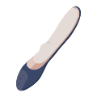 | E-Love G-Spotter | 10110 | EL | False | False | False | 0. Vibration (VIBRATION) 2. EStim (E_STIM_AMPLITUDE) 3. EStim (E_STIM_PULSEWIDTH) 4. EStim (E_STIM_FREQUENCY) |
| 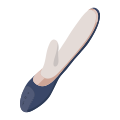 | E-Love G-Spotter+ | 10111 | EL | False | False | False | 0. Shaft (VIBRATION) 1. Rabbit (VIBRATION) 2. EStim (E_STIM_AMPLITUDE) 3. EStim (E_STIM_PULSEWIDTH) 4. EStim (E_STIM_FREQUENCY) |
|  | E-Love Story | 10112 | EY | False | False | False | 0. Vibration (VIBRATION) 2. EStim (E_STIM_AMPLITUDE) 3. EStim (E_STIM_PULSEWIDTH) 4. EStim (E_STIM_FREQUENCY) |
|  | Epic Duo | 10167 | RG | False | False | True | 0. Vibration (VIBRATION) |
|  | G-Spot Flex 4+ | 10192 | PA | False | False | True | 0. Vibration (VIBRATION) |
| 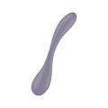 | G-Spot Flex 5+ | 10193 | PA | False | False | True | 0. Vibration (VIBRATION) |
|  | G-Spot Flex 5+ | 10194 | PA | False | False | True | 0. Vibration (VIBRATION) |
| 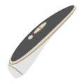 | Haute Couture+ | 10013 | LU | False | False | False | 0. Vibration (VIBRATION) 1. Air Pulse (AIRPULSE) |
| 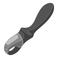 | Heat Climax | 10010 | HV | True | False | False | 0. Vibration (VIBRATION) |
| 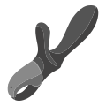 | Heat Climax+ | 10011 | HV | True | False | False | 0. Shaft (VIBRATION) 1. Rabbit (VIBRATION) | | Heat Vibes G-Spot (Virtual) | 2 | HV | True | False | False | 0. Vibration (VIBRATION) |
| | Heat Vibes Rabbit (Virtual) | 3 | HV | True | False | False | 0. Vibration (VIBRATION) 1. Airpulse (AIRPULSE) 2. Motor3 |
| 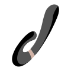 | Heat Wave | 10069 | HV | True | False | False | 0. Shaft (VIBRATION) 1. Rabbit (VIBRATION) |
|  | Heat Wave | 10070 | HV | True | False | False | 0. Shaft (VIBRATION) 1. Rabbit (VIBRATION) |
|  | Heat Wave | 10071 | HV | True | False | False | 0. Shaft (VIBRATION) 1. Rabbit (VIBRATION) |
|  | Heated Affair | 10006 | HV | True | False | False | 0. Shaft (VIBRATION) 1. Rabbit (VIBRATION) |
| 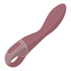 | Heated Thrill | 10008 | HV | True | False | False | 0. Vibration (VIBRATION) |
| 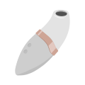 | Hero+ | 10090 | HE | False | False | False | 0. Air Pulse (AIRPULSE) |
| 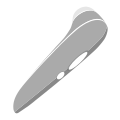 | High Fashion+ | 10014 | LU | False | False | False | 0. Vibration (VIBRATION) 1. Air Pulse (AIRPULSE) |
|  | Hot Bunny | 10009 | HV | True | False | False | 0. Shaft (VIBRATION) 1. Rabbit (VIBRATION) |
|  | Hot Lover | 10059 | HL | True | False | False | 0. Shaft (VIBRATION) 1. Rabbit (VIBRATION) |
|  | Hot Lover | 10060 | HL | True | False | False | 0. Shaft (VIBRATION) 1. Rabbit (VIBRATION) |
|  | Hot Lover | 10061 | HL | True | False | False | 0. Shaft (VIBRATION) 1. Rabbit (VIBRATION) |
| 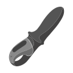 | Hot Passion | 10012 | HV | True | False | False | 0. Vibration (VIBRATION) |
|  | Hot Spot | 10005 | HV | True | False | False | 0. Vibration (VIBRATION) |
| 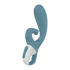 | Hug me | 10186 | PX | False | False | False | 0. Shaft (VIBRATION) 1. Rabbit (VIBRATION) |
| 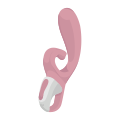 | Hug me | 10187 | PX | False | False | False | 0. Shaft (VIBRATION) 1. Rabbit (VIBRATION) |
|  | Intensity Plug | 10183 | AV | False | False | False | 0. Vibration (VIBRATION) |
|  | Intensity Plug | 10184 | AV | False | False | False | 0. Vibration (VIBRATION) |
|  | Knight+ | 10091 | HE | False | False | False | 0. Air Pulse (AIRPULSE) |
| 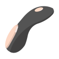 | Little Secret | 10072 | SR | False | False | True | 0. Vibration (VIBRATION) |
|  | Love Birds 1 | 10119 | BU | False | False | False | 0. G-Spot (VIBRATION) |
|  | Love Birds 1 | 10120 | BU | False | False | False | 0. G-Spot (VIBRATION) |
|  | Love Birds 1 | 10182 | BU | False | False | False | 0. G-Spot (VIBRATION) |
|  | Love Birds 2 | 10121 | BU | False | False | False | 0. G-Spot (VIBRATION) |
|  | Love Birds 2 | 10122 | BU | False | False | False | 0. G-Spot (VIBRATION) |
|  | Love Birds 2 | 10123 | BU | False | False | False | 0. G-Spot (VIBRATION) |
|  | Love Birds Vary | 10124 | BU | False | False | False | 0. G-Spot (VIBRATION) |
|  | Love Birds Vary | 10125 | BU | False | False | False | 0. G-Spot (VIBRATION) |
|  | Love Birds Vary | 10126 | BU | False | False | False | 0. G-Spot (VIBRATION) |
| 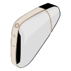 | Love Triangle | 10024 | NL | False | False | False | 0. Vibration (VIBRATION) 1. Air Pulse (AIRPULSE) |
| 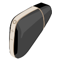 | Love Triangle | 10025 | NL | False | False | False | 0. Vibration (VIBRATION) 1. Air Pulse (AIRPULSE) |
| 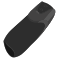 | Men Vibration+ | 10140 | MN | False | False | False | 0. Tip (VIBRATION) 1. Base (VIBRATION) |
| | Men Vibrator Heat (Virtual) | 4 | HV | True | False | False | 0. Vibration (VIBRATION) |
|  | Mighty One | 10075 | RG | False | False | True | 0. Vibration (VIBRATION) |
|  | Mini Wand-er+ | 10197 | PA | False | False | True | 0. Clitoral (VIBRATION) 1. G-Spot (VIBRATION) |
|  | Mini Wand-er+ | 10198 | PA | False | False | True | 0. Vibration (VIBRATION) |
|  | Mono Flex | 10062 | MF | False | False | False | 0. Shaft (VIBRATION) 1. Rabbit (VIBRATION) |
|  | Mono Flex | 10063 | MF | False | False | False | 0. Shaft (VIBRATION) 1. Rabbit (VIBRATION) |
| 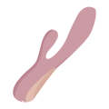 | Mono Flex | 10064 | MF | False | False | False | 0. Shaft (VIBRATION) 1. Rabbit (VIBRATION) |
|  | Newcomer+ | 10092 | HE | False | False | False | 0. Air Pulse (AIRPULSE) |
| 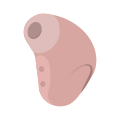 | Newcomer+ | 10093 | HE | False | False | False | 0. Air Pulse (AIRPULSE) |
| | Partner Plus 1 (Virtual) | 1 | HV | False | False | False | 0. Vibration (VIBRATION) 1. Airpulse (AIRPULSE) |
| 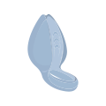 | Perfect Pair 4 | 10205 | RG | False | False | True | 0. Vibration (VIBRATION) |
|  | Pleasure Wand+ | 10168 | PA | False | False | True | 0. Vibration (VIBRATION) |
| 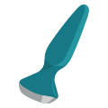 | Plug-ilicious 1 | 10100 | PL | False | False | True | 0. Tip (VIBRATION) 1. Base (VIBRATION) |
| 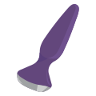 | Plug-ilicious 1 | 10101 | PL | False | False | True | 0. Tip (VIBRATION) 1. Base (VIBRATION) |
|  | Plug-ilicious 2 | 10102 | PL | False | False | True | 0. Tip (VIBRATION) 1. Base (VIBRATION) |
| 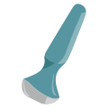 | Plug-ilicious 2 | 10103 | PL | False | False | True | 0. Tip (VIBRATION) 1. Base (VIBRATION) |
| 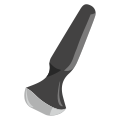 | Plug-ilicious 2 | 10104 | PL | False | False | True | 0. Tip (VIBRATION) 1. Base (VIBRATION) |
|  | Power Masturbator | 10185 | MN | False | False | False | 0. Vibration (VIBRATION) |
|  | Power Plug | 10141 | AV | False | False | False | 0. Vibration (VIBRATION) |
|  | Powerful One | 10076 | RG | False | False | True | 0. Vibration (VIBRATION) |
|  | Pro+ Wave 4 | 10196 | DT | False | False | False | 0. Wave (WAVE) 1. Air Pulse (AIRPULSE) |
| 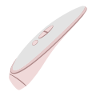 | Prêt-à-porter+ | 10015 | LU | False | False | False | 0. Vibration (VIBRATION) 1. Air Pulse (AIRPULSE) |
|  | Ribbed Petal | 10127 | BU | False | False | False | 0. G-Spot (VIBRATION) |
|  | Ribbed Petal | 10128 | BU | False | False | False | 0. G-Spot (VIBRATION) |
|  | Ribbed Petal | 10129 | BU | False | False | False | 0. G-Spot (VIBRATION) |
|  | Ribbed Petal | 10201 | BU | False | False | False | 0. G-Spot (VIBRATION) |
|  | Rotator Plug 1+ | 10142 | RT | False | False | False | 1. Rotation (ROTATION_SINGLE_DIR) 0. Vibration (VIBRATION) |
|  | Rotator Plug 1+ | 10143 | RT | False | False | False | 1. Rotation (ROTATION_SINGLE_DIR) 0. Vibration (VIBRATION) |
| 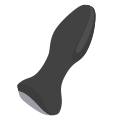 | Rotator Plug 2+ | 10144 | RT | False | False | False | 1. Rotation (ROTATION_SINGLE_DIR) 0. Vibration (VIBRATION) |
|  | Rotator Plug 2+ | 10145 | RT | False | False | False | 1. Rotation (ROTATION_SINGLE_DIR) 0. Vibration (VIBRATION) |
|  | Royal One | 10077 | RG | False | False | True | 0. Vibration (VIBRATION) |
| | Rrrolling Sensation | 10241 | CT | False | False | False | 0. Vibration (VIBRATION) 1. Rolling (ROLLING) |
| | Rrrolling Sensation | 10242 | CT | False | False | False | 0. Vibration (VIBRATION) 1. Rolling (ROLLING) |
|  | Sexy Secret | 10073 | SE | False | False | True | 0. Vibration (VIBRATION) |
|  | Shiny Petal | 10130 | BU | False | False | False | 0. G-Spot (VIBRATION) |
|  | Shiny Petal | 10131 | BU | False | False | False | 0. G-Spot (VIBRATION) |
|  | Shiny Petal | 10132 | BU | False | False | False | 0. G-Spot (VIBRATION) |
|  | Shiny Petal | 10133 | BU | False | False | False | 0. G-Spot (VIBRATION) |
|  | Signet Ring | 10078 | RG | False | False | True | 0. Vibration (VIBRATION) |
|  | Smooth Petal | 10134 | BU | False | False | False | 0. G-Spot (VIBRATION) |
|  | Smooth Petal | 10135 | BU | False | False | False | 0. G-Spot (VIBRATION) |
|  | Smooth Petal | 10136 | BU | False | False | False | 0. G-Spot (VIBRATION) |
|  | Smooth Petal | 10202 | BU | False | False | False | 0. G-Spot (VIBRATION) |
|  | Strong One | 10074 | RG | False | False | True | 0. Vibration (VIBRATION) |
|  | Sunray | 10177 | SP | False | False | False | 0. Vibration (VIBRATION) 1. Air Pulse (AIRPULSE) |
| 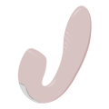 | Sunray | 10178 | SP | False | False | False | 0. Vibration (VIBRATION) 1. Air Pulse (AIRPULSE) |
|  | Sunray | 10179 | SP | False | False | False | 0. Vibration (VIBRATION) 1. Air Pulse (AIRPULSE) |
| 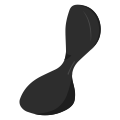 | Sweet Seal | 10148 | AV | False | False | False | 0. Vibration (VIBRATION) |
|  | Sweet Seal | 10149 | AV | False | False | False | 0. Vibration (VIBRATION) |
|  | Threesome 4 | 10190 | SP | False | False | False | 0. Vibration (VIBRATION) 1. Vibration (VIBRATION) |
| 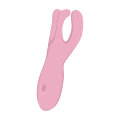 | Threesome 4 | 10191 | SP | False | False | False | 0. Vibration (VIBRATION) 1. Vibration (VIBRATION) |
|  | Top Secret | 10169 | PL | False | False | True | 0. G-Spot (VIBRATION) 1. Clitoral (VIBRATION) |
|  | Top Secret | 10170 | PL | False | False | True | 0. G-Spot (VIBRATION) 1. Clitoral (VIBRATION) |
|  | Top Secret | 10171 | PL | False | False | True | 0. G-Spot (VIBRATION) 1. Clitoral (VIBRATION) |
|  | Top Secret+ | 10172 | PL | False | False | True | 0. G-Spot & Clitoral (VIBRATION) 1. Anal (VIBRATION) |
|  | Top Secret+ | 10173 | PL | False | False | True | 0. G-Spot & Clitoral (VIBRATION) 1. Anal (VIBRATION) |
|  | Top Secret+ | 10174 | PL | False | False | True | 0. G-Spot & Clitoral (VIBRATION) 1. Anal (VIBRATION) |
| 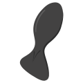 | Trendsetter | 10150 | AV | False | False | False | 0. Vibration (VIBRATION) |
| 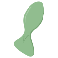 | Trendsetter | 10151 | AV | False | False | False | 0. Vibration (VIBRATION) |
| 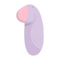 | Tropical Tip | 10199 | LB | False | False | False | 0. Vibration (VIBRATION) |
| 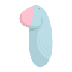 | Tropical Tip | 10200 | LB | False | False | False | 0. Vibration (VIBRATION) |
|  | Twirling Joy | 10154 | TV | False | False | False | 0. Vibration (VIBRATION) |
|  | Twirling Joy | 10155 | TV | False | False | False | 0. Vibration (VIBRATION) |
|  | Twirling Joy | 10156 | TV | False | False | False | 0. Vibration (VIBRATION) |
| 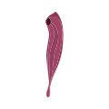 | Twirling Pro+ | 10203 | SP | False | False | False | 0. Vibration (VIBRATION) 1. Air Pulse (AIRPULSE) |
| 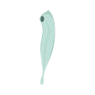 | Twirling Pro+ | 10204 | SP | False | False | False | 0. Vibration (VIBRATION) 1. Air Pulse (AIRPULSE) |
|  | Ultra Power Bullet 8 | 10157 | PV | False | False | False | 0. Vibration (VIBRATION) |
|  | Ultra Power Bullet 8 | 10158 | PV | False | False | False | 0. Vibration (VIBRATION) |

## Constants

### BleControl

| Constant | Value |
|---|---|
| GET_DRAW_VALUE_INTERVAL_MICROS | 12500L |
| GET_DRAW_VALUE_INTERVAL_MILLIS | 12.5F |
| GET_VALUE_INTERVAL_MICROS | 12500L |
| GET_VALUE_INTERVAL_MILLIS | 12.5F |
| INTENSITY_FACTOR | 100 |
| LIVE_CONTROL_MIN_SAVE_DURATION_MS | 2000L |
| LIVE_MODE_ARRAY_LENGTH | 4 |
| MAX_LOOP_DRAW_BUFFER_CAPACITY | 72000 |
| MAX_LOOP_DURATION_MILLIS | 900000L |
| MAX_LOOP_DURATION_MINUTES | 15L |
| MAX_LOOP_SEND_BUFFER_CAPACITY | 72000 |
| MAX_PATTERN_DURATION_MILLIS | 900000L |
| MAX_PROGRAM_DURATION_MIN | 15L |
| MAX_RECORD_CAPACITY | 72000 |
| MIN_LOOP_DRAW_POINTS | 10 |
| MIN_LOOP_DURATION_MILLIS | 1000L |
| MIN_LOOP_SEND_POINTS | 10 |
| MIN_PROGRAM_DURATION_MILLIS | 5000L |
| MIN_PROGRAM_DURATION_SEC | 5L |
| MIN_PROGRAM_POINTS_COUNT | 400 |
| MIN_SUPPORT_HEARTBEAT_FIRMWARE_VER | "2.0.24" |
| MIN_SUPPORT_KEEP_ALIVE_FIRMWARE_VER | "2.0.34" |

### Device

| Constant | Value |
|---|---|
| NONE_MOTORS | 0 |
| ONE_MOTOR | 1 |
| TWO_MOTORS | 2 |
| THREE_MOTORS | 3 |

### Label

| Constant | Value |
|---|---|
| FIRST_MOTOR | 1 |
| SECOND_MOTOR | 2 |
| THIRD_MOTOR | 3 |

### PresetInfo

| Constant | Value |
|---|---|
| POWER_BYTE | 0 |
| BATTER_BYTE | 1 |
| HEATER_BYTE | 2 |
| PWM1_BYTE | 3 |
| PWM2_BYTE | 4 |
| PWM3_BYTE | 5 |
| PWM4_BYTE | 6 |
| PWM5_BYTE | 7 |
| LEDS1_2_BYTE | 8 |
| LEDS2_3_BYTE | 9 |
| BUTTON1_BYTE | 10 |
| BUTTON2_BYTE | 11 |
| BUTTON3_BYTE | 12 |
| BUTTON4_BYTE | 13 |
| BUTTON5_BYTE | 14 |
| BUTTON6_BYTE | 15 |
| BUTTON7_BYTE | 16 |
| RESERVED_BYTE | 17 |
| FUNCNUM_BYTE | 18 |
| BLOCKNUM_BYTE | 19 |

### BleScanStatus

| BleScanStatus | Value |
|---|---|
| SUCCESS | 0 |
| ERROR | 1 |
| LOADING | 2 |

### ConnectionState

| ConnectionState | Value |
|---|---|
| CONNECTED | 0 |
| DISCONNECTED | 1 |
| CONNECTION_LOST | 2 |
| DISCONNECTING | 3 |
| CONNECTING | 4 |
| PENDING_CONNECTING | 5 |

### PingDeviceType

| PingDeviceType | Value |
|---|---|
| LEGACY_MODE | 0 |
| HEARTBEAT_MODE | 1 |
| NONE | 2 |

### FirmwareState

| FirmwareState | Value |
|---|---|
| ACTUAL | 0 |
| UPDATING | 1 |
| UPDATE_AVAILABLE | 2 |
| UPDATE_REQUIRED | 3 |
| SILENT_UPDATE_REQUIRED | 4 |

## Patterns

### defaultPatterns

| icon | name | id | data |
|---|---|---|---|
|  | Even Steven | -10 | <pre>[66, 66, 66, 66, 66, 66, 66, 66, 66, 66, 66, 66, 66, 66, 66, 66, 66, 66, 66, 66, 66, 66, 66, 66, 66, 66, 66, 66, 66, 66, 66, 66, 66, 66, 66, 66, 66, 66, 66, 66, 66, 66, 66, 66, 66, 66, 66, 66, 66, 66, 66, 66, 66, 66, 66, 66, 66, 66, 66, 66, 66, 66, 66, 66, 66, 66, 66, 66, 66, 66, 66, 66, 66, 66, 66, 66, 66, 66, 66, 66, 66, 66, 66, 66, 66, 66, 66, 66, 66, 66, 66, 66, 66, 66, 66, 66, 66, 66, 66, 66, 66, 66, 66, 66, 66, 66, 66, 66, 66, 66, 66, 66, 66, 66, 66, 66, 66, 66, 66, 66, 66, 66, 66, 66, 66, 66, 66, 66, 66, 66, 66, 66, 66, 66, 66, 66, 66, 66, 66, 66, 66, 66, 66, 66, 66, 66, 66, 66, 66, 66, 66, 66, 66, 66, 66, 66, 66, 66, 66, 66]</pre>
| 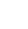 | Vibration | -11 | <pre>[7, 15, 23, 31, 39, 47, 54, 62, 70, 78, 86, 94, 98, 100, 98, 94, 86, 78, 70, 62, 54, 47, 39, 31, 23, 15, 7, 7, 15, 23, 31, 39, 47, 54, 62, 70, 78, 86, 94, 98, 100, 98, 94, 86, 78, 70, 62, 54, 47, 39, 31, 23, 15, 7, 7, 15, 23, 31, 39, 47, 54, 62, 70, 78, 86, 94, 98, 100, 98, 94, 86, 78, 70, 62, 54, 47, 39, 31, 23, 15, 7, 7, 15, 23, 31, 39, 47, 54, 62, 70, 78, 86, 94, 98, 100, 98, 94, 86, 78, 70, 62, 54, 47, 39, 31, 23, 15, 7, 7, 15, 23, 31, 39, 47, 54, 62, 70, 78, 86, 94, 98, 100, 98, 94, 86, 78, 70, 62, 54, 47, 39, 31, 23, 15, 7, 7, 15, 23, 31, 39, 47, 54, 62, 70, 78, 86, 94, 98, 100, 98, 94, 86, 78, 70, 62, 54, 47, 39, 31, 23, 15, 7]</pre>
|  | Wave | -12 | <pre>[0, 0, 0, 0, 0, 1, 2, 3, 3, 5, 6, 9, 11, 13, 17, 20, 24, 28, 32, 37, 42, 48, 53, 58, 63, 68, 72, 76, 80, 83, 86, 89, 91, 93, 94, 96, 96, 98, 99, 99, 100, 100, 100, 100, 100, 100, 100, 99, 99, 98, 97, 96, 95, 93, 91, 89, 87, 84, 81, 77, 73, 68, 64, 59, 54, 48, 43, 38, 33, 28, 24, 20, 17, 13, 11, 9, 6, 5, 3, 3, 1, 0, 0, 0, 0, 0, 0, 0, 0, 0, 0, 1, 2, 3, 3, 5, 6, 9, 11, 13, 17, 20, 24, 28, 33, 37, 42, 48, 53, 58, 63, 68, 72, 76, 80, 83, 86, 89, 91, 93, 94, 96, 96, 97, 98, 99, 100, 100, 100, 100, 100, 100, 100, 99, 99, 98, 97, 96, 95, 93, 92, 90, 88, 86, 82, 79, 75, 72, 68, 63, 58, 54, 49, 44, 38, 34, 29, 24, 20, 17, 13, 10, 7, 6, 4, 3, 1, 0, 0, 0, 0]</pre>
|  | Pulses | -13 | <pre>[100, 100, 100, 100, 100, 0, 0, 100, 100, 100, 100, 100, 0, 0, 100, 100, 100, 100, 100, 0, 0, 100, 100, 100, 100, 100, 0, 0, 100, 100, 100, 100, 100, 0, 0, 100, 100, 100, 100, 100, 0, 0, 100, 100, 100, 100, 100, 0, 0, 100, 100, 100, 100, 100, 0, 0, 100, 100, 100, 100, 100, 0, 0, 100, 100, 100, 100, 100, 0, 0, 100, 100, 100, 100, 100, 0, 0, 100, 100, 100, 100, 100, 0, 0, 100, 100, 100, 100, 100, 0, 0, 100, 100, 100, 100, 100, 0, 0, 100, 100, 100, 100, 100, 0, 0, 100, 100, 100, 100, 100, 0, 0, 100, 100, 100, 100, 100, 0, 0, 100, 100, 100, 100, 100, 0, 0, 100, 100, 100, 100, 100, 0, 0, 24, 24, 24, 24, 24, 24, 24, 24, 24, 24, 24, 24, 24, 24, 24, 24, 24, 24, 24, 24, 24, 24, 24, 24, 24, 24, 24, 24, 24, 24, 24, 24, 24, 24, 24, 24, 24, 24, 24, 24, 24, 24, 24, 24, 24, 24, 24, 24, 24, 24, 24, 24, 24, 24, 24, 24, 24, 24, 24, 24, 24, 24, 24, 24, 24, 24, 24]</pre>
|  | Accelerator | -14 | <pre>[5, 5, 5, 5, 5, 5, 5, 5, 5, 5, 5, 5, 5, 5, 5, 5, 5, 5, 5, 100, 100, 100, 100, 100, 100, 100, 100, 100, 100, 100, 100, 100, 100, 100, 100, 100, 100, 100, 5, 5, 5, 5, 5, 5, 5, 5, 5, 5, 5, 5, 5, 5, 5, 5, 5, 5, 100, 100, 100, 100, 100, 100, 100, 100, 100, 100, 100, 100, 100, 100, 100, 100, 100, 100, 5, 5, 5, 5, 5, 5, 5, 5, 5, 5, 5, 5, 5, 5, 5, 5, 5, 100, 100, 100, 100, 100, 100, 100, 100, 100, 100, 100, 100, 100, 100, 100, 100, 100, 5, 5, 5, 5, 5, 5, 5, 5, 5, 5, 5, 5, 5, 5, 5, 5, 100, 100, 100, 100, 100, 100, 100, 100, 100, 100, 100, 100, 100, 100, 100, 100, 5, 5, 5, 5, 5, 5, 5, 5, 5, 5, 5, 5, 5, 5, 5, 100, 100, 100, 100, 100, 100, 100, 100, 100, 100, 100, 100, 100, 100, 100, 5, 5, 5, 5, 5, 5, 5, 5, 5, 5, 5, 5, 5, 5, 100, 100, 100, 100, 100, 100, 100, 100, 100, 100, 100, 100, 100, 100, 5, 5, 5, 5, 5, 5, 5, 5, 5, 5, 5, 5, 5, 100, 100, 100, 100, 100, 100, 100, 100, 100, 100, 100, 100, 100, 5, 5, 5, 5, 5, 5, 5, 5, 5, 5, 5, 5, 100, 100, 100, 100, 100, 100, 100, 100, 100, 100, 100, 100, 5, 5, 5, 5, 5, 5, 5, 5, 5, 5, 5, 100, 100, 100, 100, 100, 100, 100, 100, 100, 100, 100, 5, 5, 5, 5, 5, 5, 5, 5, 5, 5, 100, 100, 100, 100, 100, 100, 100, 100, 100, 100, 5, 5, 5, 5, 5, 5, 5, 5, 5, 100, 100, 100, 100, 100, 100, 100, 100, 100, 5, 5, 5, 5, 5, 5, 5, 5, 100, 100, 100, 100, 100, 100, 100, 100, 5, 5, 5, 5, 5, 5, 5, 100, 100, 100, 100, 100, 100, 100, 5, 5, 5, 5, 5, 5, 100, 100, 100, 100, 100, 100, 5, 5, 5, 5, 5, 100, 100, 100, 100, 100, 5, 5, 5, 5, 100, 100, 100, 100, 5, 5, 5, 100, 100, 100, 5, 5, 100, 100, 5, 100, 69, 69, 69, 69, 80, 80, 80]</pre>
|  | Big Fun | -15 | <pre>[55, 55, 55, 55, 55, 55, 55, 55, 55, 55, 55, 55, 55, 55, 55, 55, 55, 55, 55, 55, 55, 55, 55, 55, 55, 55, 55, 55, 55, 55, 55, 55, 54, 46, 39, 32, 26, 20, 16, 12, 9, 6, 4, 3, 2, 0, 0, 0, 0, 0, 0, 0, 0, 0, 2, 3, 5, 6, 10, 13, 17, 21, 27, 34, 41, 48, 56, 63, 70, 76, 82, 86, 90, 93, 95, 97, 98, 99, 100, 100, 100, 100, 99, 98, 97, 95, 93, 89, 86, 82, 76, 70, 63, 55, 48, 41, 36, 32, 30, 27, 26, 24, 24, 24, 23, 23, 23, 23, 24, 24, 24, 26, 27, 29, 32, 36, 41, 48, 55, 62, 67, 72, 75, 78, 79, 82, 82, 84, 85, 85, 86, 86, 86, 86, 85, 85, 84, 82, 82, 80, 78, 75, 72, 67, 61, 54, 48, 44, 41, 40, 39, 38, 37, 37, 37, 37, 37, 37, 37, 37, 38, 39, 40, 41, 43, 47, 52, 55, 55, 55, 55, 55, 55, 55, 55, 55, 55, 55, 55, 55, 55, 55, 55, 55, 55, 55, 55, 55, 55, 55, 55, 55, 55, 55]</pre>

### devicePatterns

| icon | name | id | data |
|---|---|---|---|
|  | Slow Crests | -101 | <pre>[0, 1, 3, 4, 6, 7, 9, 10, 12, 14, 15, 17, 18, 20, 21, 23, 25, 26, 28, 29, 31, 32, 34, 36, 37, 39, 40, 42, 43, 45, 47, 48, 50, 51, 53, 54, 56, 58, 59, 61, 62, 64, 65, 67, 69, 70, 72, 73, 75, 76, 78, 80, 81, 83, 84, 86, 87, 89, 90, 92, 94, 95, 97, 98, 100, 100, 98, 97, 95, 94, 92, 90, 89, 87, 86, 84, 83, 81, 80, 78, 76, 75, 73, 72, 70, 69, 67, 65, 64, 62, 61, 59, 58, 56, 54, 53, 51, 50, 48, 47, 45, 43, 42, 40, 39, 37, 36, 34, 32, 31, 29, 28, 26, 25, 23, 21, 20, 18, 17, 15, 14, 12, 10, 9, 7, 6, 4, 3, 1, 0, 0, 1, 3, 4, 6, 7, 9, 10, 12, 14, 15, 17, 18, 20, 21, 23, 25, 26, 28, 29, 31, 32, 34, 36, 37, 39, 40, 42, 43, 45, 47, 48, 50, 51, 53, 54, 56, 58, 59, 61, 62, 64, 65, 67, 69, 70, 72, 73, 75, 76, 78, 80, 81, 83, 84, 86, 87, 89, 90, 92, 94, 95, 97, 98, 100, 100, 98, 97, 95, 94, 92, 90, 89, 87, 86, 84, 83, 81, 80, 78, 76, 75, 73, 72, 70, 69, 67, 65, 64, 62, 61, 59, 58, 56, 54, 53, 51, 50, 48, 47, 45, 43, 42, 40, 39, 37, 36, 34, 32, 31, 29, 28, 26, 25, 23, 21, 20, 18, 17, 15, 14, 12, 10, 9, 7, 6, 4, 3, 1, 0]</pre>
|  | Fast Crests | -102 | <pre>[0, 3, 7, 10, 14, 17, 21, 24, 28, 31, 35, 38, 42, 45, 49, 52, 56, 60, 63, 67, 70, 74, 77, 81, 84, 88, 91, 95, 98, 100, 98, 95, 91, 88, 84, 81, 77, 74, 70, 67, 63, 60, 56, 52, 49, 45, 42, 38, 35, 31, 28, 24, 21, 17, 14, 10, 7, 3, 0, 3, 7, 10, 14, 17, 21, 24, 28, 31, 35, 38, 42, 45, 49, 52, 56, 60, 63, 67, 70, 74, 77, 81, 84, 88, 91, 95, 98, 100, 98, 95, 91, 88, 84, 81, 77, 74, 70, 67, 63, 60, 56, 52, 49, 45, 42, 38, 35, 31, 28, 24, 21, 17, 14, 10, 7, 3, 0, 3, 7, 10, 14, 17, 21, 24, 28, 31, 35, 38, 42, 45, 49, 52, 56, 60, 63, 67, 70, 74, 77, 81, 84, 88, 91, 95, 98, 100, 98, 95, 91, 88, 84, 81, 77, 74, 70, 67, 63, 60, 56, 52, 49, 45, 42, 38, 35, 31, 28, 24, 21, 17, 14, 10, 7, 3]</pre>
|  | Ultrasonic | -103 | <pre>[100, 100, 100, 100, 100, 0, 0, 100, 100, 100, 100, 100, 0, 0, 100, 100, 100, 100, 100, 0, 0, 100, 100, 100, 100, 100, 0, 0, 100, 100, 100, 100, 100, 0, 0, 100, 100, 100, 100, 100, 0, 0, 100, 100, 100, 100, 100, 0, 0, 100, 100, 100, 100, 100, 0, 0, 100, 100, 100, 100, 100, 0, 0, 100, 100, 100, 100, 100, 0, 0, 100, 100, 100, 100, 100, 0, 0, 100, 100, 100, 100, 100, 0, 0, 100, 100, 100, 100, 100, 0, 0, 100, 100, 100, 100, 100, 0, 0, 100, 100, 100, 100, 100, 0, 0, 100, 100, 100, 100, 100, 0, 0, 100, 100, 100, 100, 100, 0, 0, 100, 100, 100, 100, 100, 0, 0, 100, 100, 100, 100, 100, 0, 0, 100, 100, 100, 100, 100, 0, 0, 100, 100, 100, 100, 100, 0, 0, 100, 100, 100, 100, 100, 0, 0, 100, 100, 100, 100, 100, 0, 0]</pre>
|  | Low & Steady | -104 | <pre>[16, 16, 16, 16, 16, 16, 16, 16, 16, 16, 16, 16, 16, 16, 16, 16, 16, 16, 16, 16, 16, 16, 16, 16, 16, 16, 16, 16, 16, 16, 16, 16, 16, 16, 16, 16, 16, 16, 16, 16, 16, 16, 16, 16, 16, 16, 16, 16, 16, 16, 16, 16, 16, 16, 16, 16, 16, 16, 16, 16, 16, 16, 16, 16, 16, 16, 16, 16, 16, 16, 16, 16, 16, 16, 16, 16, 16, 16, 16, 16, 16, 16, 16, 16, 16, 16, 16, 16, 16, 16, 16, 16, 16, 16, 16, 16, 16, 16, 16, 16, 16, 16, 16, 16, 16, 16, 16, 16, 16, 16, 16, 16, 16, 16, 16, 16, 16, 16, 16, 16, 16, 16, 16, 16, 16, 16, 16, 16, 16, 16, 16, 16, 16, 16, 16, 16, 16, 16, 16, 16, 16, 16, 16, 16, 16, 16, 16, 16, 16, 16, 16, 16, 16, 16, 16, 16, 16, 16, 16, 16]</pre>
|  | Steady Freddie 2 | -105 | <pre>[33, 33, 33, 33, 33, 33, 33, 33, 33, 33, 33, 33, 33, 33, 33, 33, 33, 33, 33, 33, 33, 33, 33, 33, 33, 33, 33, 33, 33, 33, 33, 33, 33, 33, 33, 33, 33, 33, 33, 33, 33, 33, 33, 33, 33, 33, 33, 33, 33, 33, 33, 33, 33, 33, 33, 33, 33, 33, 33, 33, 33, 33, 33, 33, 33, 33, 33, 33, 33, 33, 33, 33, 33, 33, 33, 33, 33, 33, 33, 33, 33, 33, 33, 33, 33, 33, 33, 33, 33, 33, 33, 33, 33, 33, 33, 33, 33, 33, 33, 33, 33, 33, 33, 33, 33, 33, 33, 33, 33, 33, 33, 33, 33, 33, 33, 33, 33, 33, 33, 33, 33, 33, 33, 33, 33, 33, 33, 33, 33, 33, 33, 33, 33, 33, 33, 33, 33, 33, 33, 33, 33, 33, 33, 33, 33, 33, 33, 33, 33, 33, 33, 33, 33, 33, 33, 33, 33, 33, 33, 33]</pre>
|  | Mid & Even | -106 | <pre>[49, 49, 49, 49, 49, 49, 49, 49, 49, 49, 49, 49, 49, 49, 49, 49, 49, 49, 49, 49, 49, 49, 49, 49, 49, 49, 49, 49, 49, 49, 49, 49, 49, 49, 49, 49, 49, 49, 49, 49, 49, 49, 49, 49, 49, 49, 49, 49, 49, 49, 49, 49, 49, 49, 49, 49, 49, 49, 49, 49, 49, 49, 49, 49, 49, 49, 49, 49, 49, 49, 49, 49, 49, 49, 49, 49, 49, 49, 49, 49, 49, 49, 49, 49, 49, 49, 49, 49, 49, 49, 49, 49, 49, 49, 49, 49, 49, 49, 49, 49, 49, 49, 49, 49, 49, 49, 49, 49, 49, 49, 49, 49, 49, 49, 49, 49, 49, 49, 49, 49, 49, 49, 49, 49, 49, 49, 49, 49, 49, 49, 49, 49, 49, 49, 49, 49, 49, 49, 49, 49, 49, 49, 49, 49, 49, 49, 49, 49, 49, 49, 49, 49, 49, 49, 49, 49, 49, 49, 49, 49]</pre>
|  | Even Steven 5 | -107 | <pre>[83, 83, 83, 83, 83, 83, 83, 83, 83, 83, 83, 83, 83, 83, 83, 83, 83, 83, 83, 83, 83, 83, 83, 83, 83, 83, 83, 83, 83, 83, 83, 83, 83, 83, 83, 83, 83, 83, 83, 83, 83, 83, 83, 83, 83, 83, 83, 83, 83, 83, 83, 83, 83, 83, 83, 83, 83, 83, 83, 83, 83, 83, 83, 83, 83, 83, 83, 83, 83, 83, 83, 83, 83, 83, 83, 83, 83, 83, 83, 83, 83, 83, 83, 83, 83, 83, 83, 83, 83, 83, 83, 83, 83, 83, 83, 83, 83, 83, 83, 83, 83, 83, 83, 83, 83, 83, 83, 83, 83, 83, 83, 83, 83, 83, 83, 83, 83, 83, 83, 83, 83, 83, 83, 83, 83, 83, 83, 83, 83, 83, 83, 83, 83, 83, 83, 83, 83, 83, 83, 83, 83, 83, 83, 83, 83, 83, 83, 83, 83, 83, 83, 83, 83, 83, 83, 83, 83, 83, 83, 83]</pre>
|  | High & Steady | -108 | <pre>[100, 100, 100, 100, 100, 100, 100, 100, 100, 100, 100, 100, 100, 100, 100, 100, 100, 100, 100, 100, 100, 100, 100, 100, 100, 100, 100, 100, 100, 100, 100, 100, 100, 100, 100, 100, 100, 100, 100, 100, 100, 100, 100, 100, 100, 100, 100, 100, 100, 100, 100, 100, 100, 100, 100, 100, 100, 100, 100, 100, 100, 100, 100, 100, 100, 100, 100, 100, 100, 100, 100, 100, 100, 100, 100, 100, 100, 100, 100, 100, 100, 100, 100, 100, 100, 100, 100, 100, 100, 100, 100, 100, 100, 100, 100, 100, 100, 100, 100, 100, 100, 100, 100, 100, 100, 100, 100, 100, 100, 100, 100, 100, 100, 100, 100, 100, 100, 100, 100, 100, 100, 100, 100, 100, 100, 100, 100, 100, 100, 100, 100, 100, 100, 100, 100, 100, 100, 100, 100, 100, 100, 100, 100, 100, 100, 100, 100, 100, 100, 100, 100, 100, 100, 100, 100, 100, 100, 100, 100, 100]</pre>
|  | Spark | -109 | <pre>[51, 51, 51, 51, 51, 51, 51, 51, 51, 51, 51, 51, 51, 51, 51, 51, 51, 51, 51, 51, 51, 51, 51, 51, 51, 51, 51, 51, 51, 51, 51, 51, 51, 47, 42, 37, 32, 27, 22, 17, 12, 7, 2, 0, 4, 9, 14, 19, 24, 28, 33, 38, 42, 47, 52, 57, 62, 67, 71, 76, 81, 85, 90, 95, 100, 97, 94, 92, 89, 86, 83, 81, 78, 75, 72, 69, 67, 64, 61, 58, 56, 53, 50, 47, 45, 42, 39, 36, 33, 31, 28, 25, 28, 31, 33, 35, 38, 40, 42, 45, 48, 50, 53, 55, 57, 60, 62, 64, 67, 70, 71, 69, 67, 66, 65, 64, 62, 60, 60, 58, 57, 55, 54, 53, 51, 50, 49, 47, 46, 44, 43, 42, 43, 43, 44, 45, 46, 46, 46, 47, 48, 49, 49, 50, 50, 51, 51, 51, 51, 51, 51, 51, 51, 51, 51, 51, 51, 51, 51, 51, 51, 51, 51, 51, 51, 51, 51, 51, 51, 51, 51, 51, 51, 51, 51, 51, 51, 51, 51]</pre>
|  | Good fun | -110 | <pre>[50, 52, 54, 56, 58, 60, 62, 64, 66, 68, 70, 72, 73, 75, 77, 78, 80, 82, 83, 85, 86, 87, 89, 90, 91, 92, 93, 94, 95, 96, 97, 98, 98, 99, 99, 100, 100, 100, 100, 100, 100, 100, 100, 100, 100, 99, 99, 98, 98, 97, 96, 96, 95, 94, 93, 92, 91, 89, 88, 87, 85, 84, 82, 81, 79, 78, 76, 74, 72, 71, 69, 67, 65, 63, 61, 59, 57, 55, 53, 51, 50, 48, 46, 44, 42, 40, 38, 36, 34, 32, 30, 29, 27, 25, 23, 22, 20, 19, 17, 16, 14, 13, 12, 10, 9, 8, 7, 6, 5, 5, 4, 3, 3, 2, 2, 1, 1, 1, 1, 1, 1, 1, 1, 1, 1, 2, 2, 3, 3, 4, 5, 6, 7, 8, 9, 10, 11, 12, 14, 15, 16, 18, 19, 21, 23, 24, 26, 28, 29, 31, 33, 35, 37, 39, 41, 43, 45, 47, 49]</pre>
|  | Hammer | -111 | <pre>[10, 10, 10, 10, 10, 10, 10, 10, 10, 10, 10, 10, 10, 10, 10, 10, 10, 10, 10, 10, 10, 10, 10, 10, 10, 10, 10, 10, 10, 10, 10, 10, 10, 10, 10, 10, 10, 10, 10, 10, 10, 10, 10, 10, 10, 10, 10, 10, 10, 10, 10, 10, 10, 10, 10, 10, 40, 40, 40, 40, 40, 40, 40, 40, 40, 40, 40, 40, 40, 40, 40, 40, 40, 40, 40, 40, 40, 40, 40, 40, 40, 40, 40, 40, 40, 40, 40, 40, 40, 40, 40, 40, 40, 40, 40, 40, 40, 40, 40, 40, 40, 40, 40, 40, 40, 40, 40, 40, 40, 40, 40, 40, 40, 70, 70, 70, 70, 70, 70, 70, 70, 70, 70, 70, 70, 70, 70, 70, 70, 70, 70, 70, 70, 70, 70, 70, 70, 70, 70, 70, 70, 70, 70, 70, 70, 70, 70, 70, 70, 70, 100, 100, 100, 100, 100, 100, 100, 100, 100, 100, 100, 100, 100, 100, 100, 100, 100, 100, 100, 100, 100, 100, 100, 100, 100, 100, 100, 100, 100, 100, 100, 100, 100, 100, 100, 100, 100, 100, 100, 100, 100, 100, 100, 100, 100, 100, 100, 100, 100, 100, 100, 100, 100, 100, 100, 100, 100, 100, 100, 100, 100, 100, 100, 100, 100, 100, 100, 100, 100, 100, 100, 100, 100, 100, 100, 30, 30, 30, 30, 30, 30, 30, 30, 30, 30, 30, 30, 30, 30, 30, 30, 30, 30, 30, 30, 30, 30, 30, 30, 30, 30, 30, 30, 30, 30, 30, 30, 30, 30, 30, 30, 30, 30, 30, 30, 30, 30, 30, 30, 30, 10, 10, 10, 10, 10, 10, 10, 10, 10, 10, 10, 10, 10, 10, 10, 10, 10, 10, 10, 10, 10, 10, 10, 10, 10, 10, 10, 10, 10, 10, 10, 10, 10, 10, 10, 10, 10, 10, 10, 10, 10, 10, 10, 10, 10, 10, 10, 10, 10, 10, 10, 10, 10, 10, 10, 10, 10, 10, 10, 10, 10, 10, 10, 10, 10, 10, 10]</pre>
|  | Rumble | -112 | <pre>[44, 44, 44, 44, 44, 44, 44, 44, 44, 44, 44, 44, 44, 44, 44, 44, 44, 44, 41, 34, 27, 24, 20, 18, 17, 16, 16, 15, 15, 16, 17, 17, 20, 22, 26, 31, 38, 46, 53, 59, 64, 68, 71, 72, 73, 74, 75, 75, 75, 74, 73, 72, 68, 65, 60, 53, 45, 37, 31, 23, 17, 11, 7, 4, 3, 1, 1, 1, 1, 2, 3, 6, 10, 15, 22, 29, 37, 44, 52, 60, 68, 75, 81, 86, 91, 94, 96, 98, 100, 100, 100, 100, 99, 98, 96, 94, 90, 86, 80, 74, 67, 59, 51, 44, 37, 31, 26, 23, 20, 18, 17, 17, 17, 17, 17, 17, 19, 20, 23, 27, 32, 38, 46, 53, 60, 65, 68, 72, 73, 75, 75, 75, 75, 75, 75, 73, 71, 67, 62, 55, 48, 40, 32, 25, 19, 13, 9, 6, 3, 1, 0, 0, 0, 0, 0, 0, 2, 3, 6, 10, 15, 21, 28, 35, 43, 51, 58, 66, 73, 79, 86, 90, 93, 96, 98, 99, 99, 99, 97, 96, 93, 89, 83, 77, 70, 63, 55, 48, 44, 44, 44, 44, 44, 44, 44, 44, 44, 44, 44, 44, 44, 44, 44, 44, 44, 44, 44]</pre>

## Cui honorem, honorem

Thanks to [lorissikora](https://github.com/lorissikora) for spending his time (sometimes after midnight) to find the best approximation of songs to play on a `Double Wand-er`.